# Wynxo

**A local AI workbench for Linux, powered entirely by Ollama.**

Wynxo is a native Python + Qt Quick application. Choose the folder you are
working in, describe a task, and watch it run: a model on your own machine
answers, reads the files, folders and screenshots you attach, and — when you
turn it on — sees your screen and drives your mouse and keyboard.

No browser, no Node.js, no account, no API key, no cloud AI. Ollama does the
inference; Wynxo is the interface.

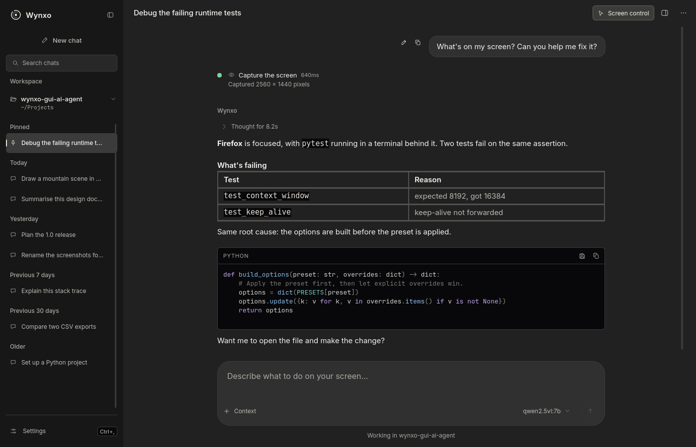

---

## Contents

- [What it does](#what-it-does)
- [Screenshots](#screenshots)
- [Requirements](#requirements)
- [Install](#install)
- [Connecting Ollama](#connecting-ollama)
- [Screen control](#screen-control)
- [Wayland and X11](#wayland-and-x11)
- [Keyboard](#keyboard)
- [Privacy](#privacy)
- [Development](#development)
- [Testing and screenshots](#testing-and-screenshots)
- [Update or remove](#update-or-remove)
- [Troubleshooting](#troubleshooting)

---

## What it does

**The workspace**
A chat-first layout: conversations and the optional workspace folder on the
left, a readable conversation in the middle, and a panel on the right for the
terminal, the workspace files and a built-in browser. One sidebar toggle stays
visible across expanded, collapsed and narrow window layouts; both side columns
become drawers when the window is too narrow to hold them. Context and model
controls live in the composer.

The charcoal interface uses softer conversation cards, a spacious composer,
and a welcome screen with responsive task starters. Copy and edit actions stay
visible beside your messages and remain reachable in narrow windows.

**Conversation**
Streamed replies with real Markdown: headings, tables, quotes, lists and links
set in the app's own type scale. Fenced code becomes a card with syntax
highlighting, copy, and save. Reasoning from a thinking model collapses to a
single line — *Thought for 8.2s* — instead of burying the answer.

**Local context**
Attach files, folders, images, the clipboard, a whole screen, a screen region
you drag out, or the active window. Everything appears as a removable chip
above the composer — one place, never duplicated — so you always know exactly
what the model can see. Image chips open a preview. Drag and drop works too.
Capturing for context uses the screenshot path only; it never asks for control
of your input.

**Local copilot**
Ask “Open KCalc” or “Check my disk space”. A tool-capable model can discover
and launch installed apps, run Bash commands, inspect files and help with code
without screen-control permission. Commands return their output and exit code,
run in the selected workspace (or home folder), and stop on cancellation or
timeout. Output is capped at 32 KB; commands default to 60 seconds, with a
maximum of 300 seconds. There is no interactive stdin or automatic elevation.

**The panel**
A right-hand panel — `Ctrl+J` — that shows the machine's side of the run.

*Terminal.* Every command Wynxo runs appears the moment it is asked for, with
its output streaming in while it is still going and a line that closes it —
exit status and duration. Applications it launches and pages it opens are noted
in the same place. There is a prompt at the bottom, so your own commands run in
the same folder and land in the same transcript; `>` is yours, `$` is Wynxo's.

*Files.* The project folder as a tree, with a read-only, syntax-highlighted
preview of anything you click and one click to send a file to the composer as
context. Caches and dependency folders are left out; dotfiles are one toggle
away. Nothing outside the workspace folder can be opened, symlinks included.

*Browser.* A page inside Wynxo, with an address bar you can drive and an
`open_url` tool that lets a model put something in front of you. The page is
shown, never scraped: nothing on it goes back to the model, so a web page
cannot tell Wynxo what to do next. The embedded view needs Qt WebEngine, which
ships with the full PySide6 package; without it the panel says so and hands the
page to your own browser.

The panel never switches tabs by itself. A tab you are not watching shows a dot
when something happens in it, and moving the view stays your decision.

**Screen control**
When enabled, a model with vision and tool calling can open applications,
click, type, scroll and drag. Every action appears inline with the task that
asked for it — one row each, with its state and duration, closing on a summary
line you can read in a second. The pointer travels rather than teleporting,
so you can see what it is about to do — and Escape stops it.

**Permission modes**
Local commands and screen actions share the selected approval mode:

| Mode | Behaviour |
| --- | --- |
| Ask | Approve commands and non-observation desktop actions |
| Safe auto *(default)* | Open apps directly; confirm commands, typing and key presses |
| Auto | Run commands and desktop actions without interrupting you |

Reading the screen and moving the pointer never prompt — they change nothing.
Commands, typing and key chords can save, send or delete in whatever has focus, so they
stay behind a prompt unless you choose Auto.

**Models**
Browse what Ollama has installed with parameter size, quantisation, disk usage,
native context window and capabilities. Favourite the ones you use, download
new tags, delete old ones. Wynxo reads capabilities from Ollama rather than
guessing from names, and warns you *before* you send if the model cannot do
what you are asking — no vision for the image you attached, no tool calling for
the desktop task, or a conversation that has nearly filled the context window.

**The project**
The workspace folder is available in the sidebar and below the composer,
offered back to you as a recent-projects list, and used as the default working
directory for commands so you do not have to repeat it every turn. Reveal it, open a
terminal in it, or copy its path from the same menu.

**Quick bar**
A floating command bar (`Ctrl+Space`) that sits above other windows for a fast
question, a screen capture, or a jump back into the full app.

**Everything else**
Command palette, full-text task search, pin, rename, duplicate, branch from any
message, edit and resend, export to Markdown, speed presets, generation metrics
on the answer they describe, desktop notifications for long unattended runs, an
optional tray icon, a resizable sidebar that remembers where you left it, five
accent themes, a compact density, and a reduced-motion setting.

---

## Screenshots

Every image below is a real capture of the running Qt application, produced by
`python -m wynxo --snapshot` (see [Testing and screenshots](#testing-and-screenshots)).

| | |
| --- | --- |
| **A new task** — where you are, and what you were doing<br>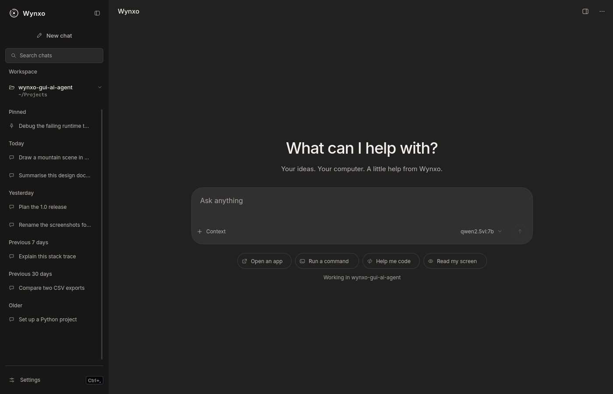 | **Local context** — files, folders and captures as chips<br>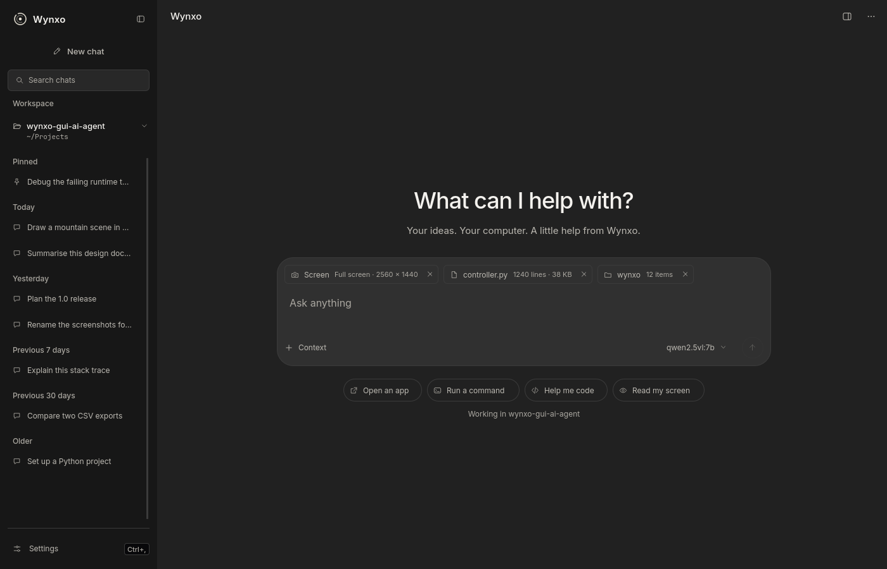 |
| **An agent run** — every action, then one summary line<br>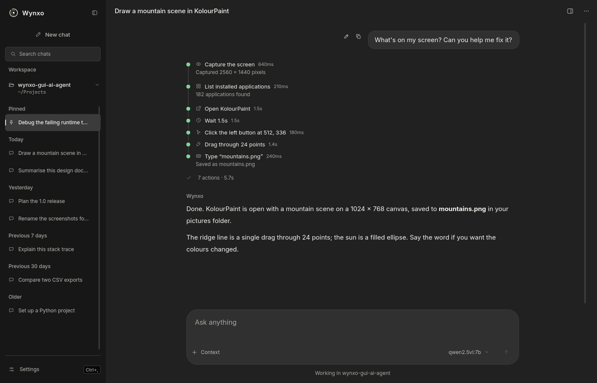 | **Permission** — the exact action, before it runs<br>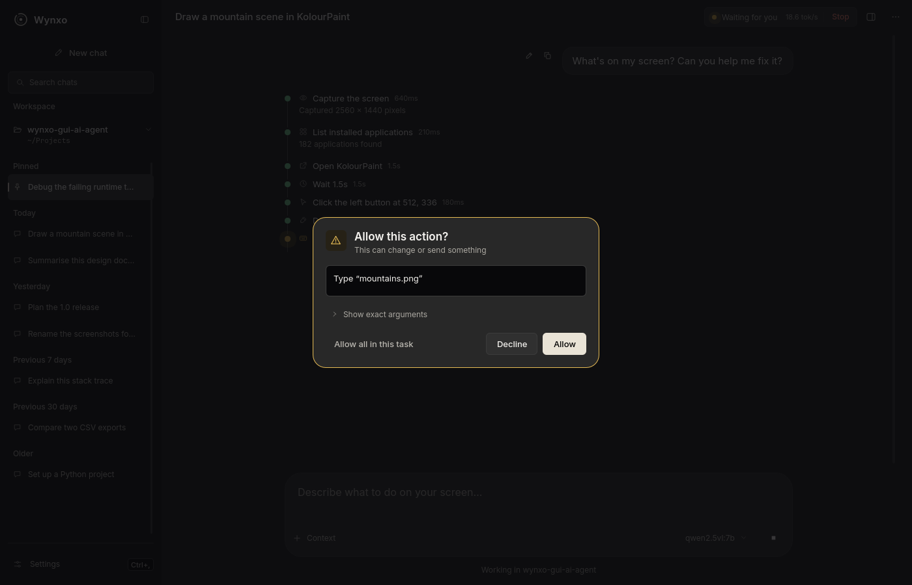 |
| **Model** — switch and set the speed in one place<br>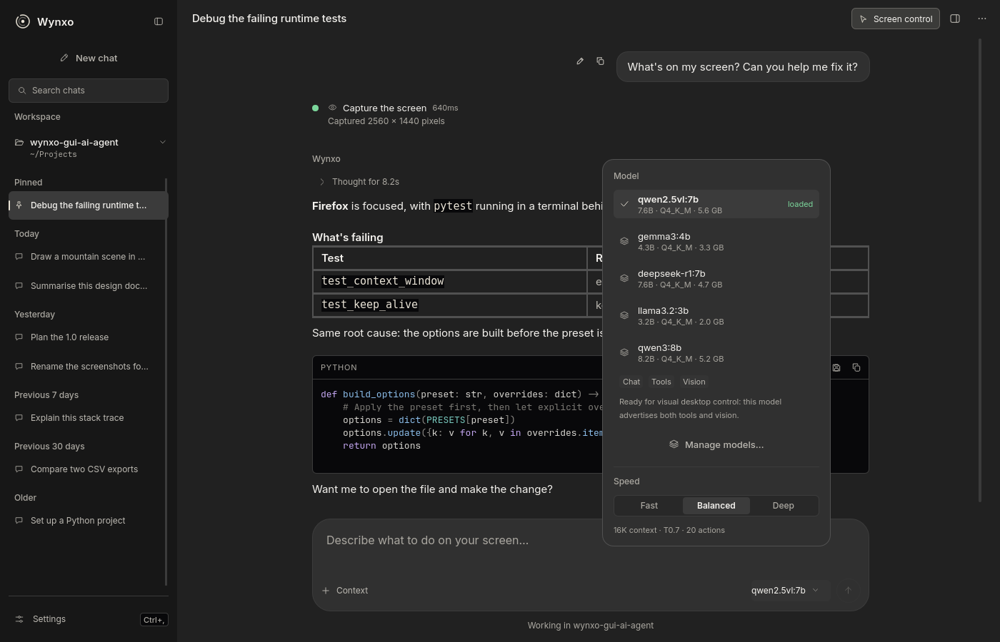 | **Model manager** — capabilities, size, favourites, downloads<br>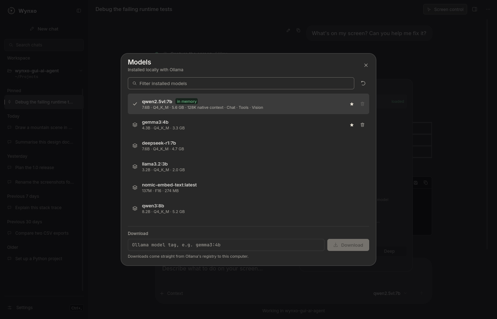 |
| **Settings** — five sections, nothing repeated<br>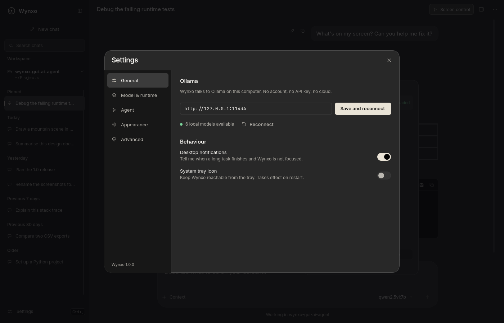 | **Command palette** — every action, one keystroke away<br>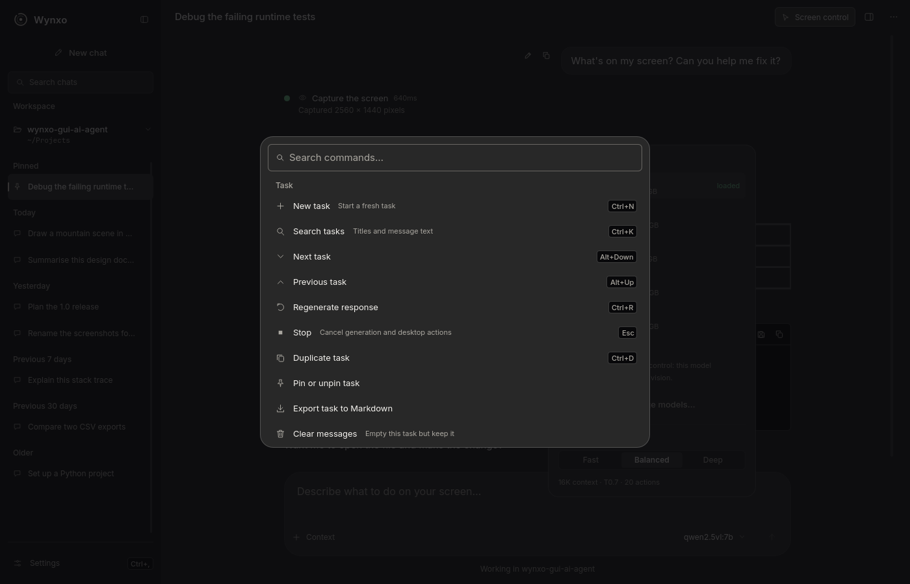 |
| **Quick bar** — `Ctrl+Space`, above everything else<br>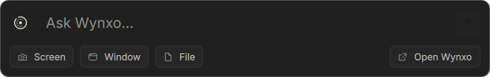 | **First run** — four steps, then out of your way<br>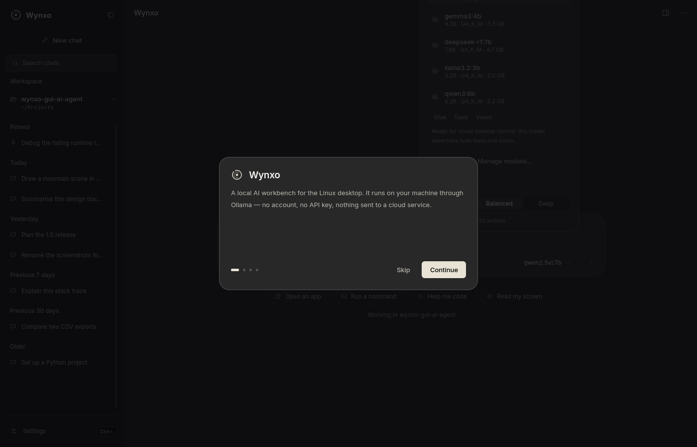 |
| **Terminal** — what Wynxo ran, as it runs<br>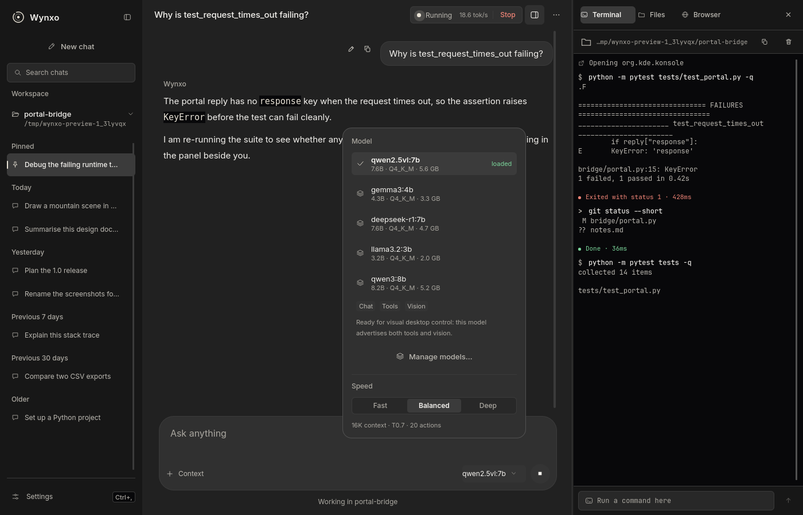 | **Files** — the project, previewed in place<br>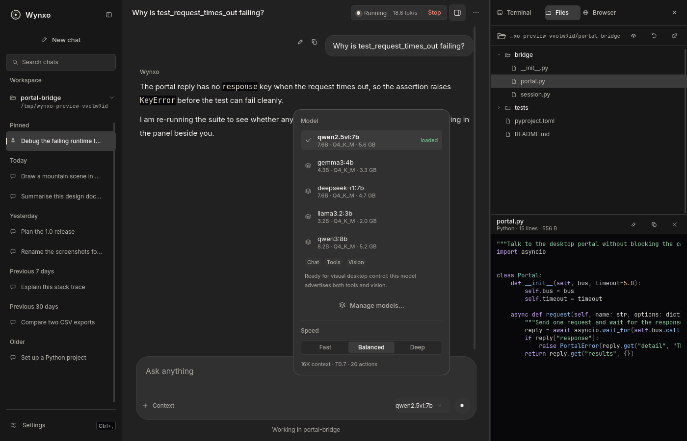 |

---

## Requirements

- Linux with a graphical session (Wayland or X11)
- Python 3.10 or newer, and Git
- [Ollama](https://docs.ollama.com/linux) running locally
- At least one local model — a vision + tools model for screen control

---

## Install

```bash
git clone https://github.com/wynxo/wynxo-gui-ai-agent.git
cd wynxo-gui-ai-agent
python3 install.py
```

`./install` does the same thing. Then open **Wynxo** from your application menu,
or run `~/.local/bin/wynxo`.

The installer builds its own Python environment, installs dependencies, and
registers a launcher, an icon and a desktop entry. It copies the app, so the
checkout can be moved or deleted afterwards. It does not need `sudo`, touch
your system Python, start a background service, install Ollama, or download a
model. The first install needs internet access for the Python packages.

If Debian or Ubuntu reports missing `venv` support:

```bash
sudo apt install python3-venv
python3 install.py
```

---

## Connecting Ollama

1. Install [Ollama for Linux](https://docs.ollama.com/linux) if you have not already.
2. Make sure it is running. If it is not managed by a service, run `ollama serve`.
3. Open Wynxo. The default address is `http://127.0.0.1:11434`; change it under
   **Settings → General** if yours differs.
4. Pick a model in the model manager (`Ctrl+M`), or download one by tag.

What a model can do depends on the capabilities Ollama reports for it:

| Capability | What Wynxo can do |
| --- | --- |
| Chat | Stream answers and save conversations |
| Tools | Run local commands, work with files, discover and launch apps |
| Vision | Read screenshots and images you attach |
| Vision + tools | Full screen control: click, type, scroll, drag |
| Thinking | Show the model's reasoning before its answer |

A large text-only model cannot see a button or a canvas; Wynxo disables the
visual tools rather than letting the model guess where to click. Model size
alone does not determine these abilities. See Ollama's
[API introduction](https://docs.ollama.com/api/introduction) and
[tool calling documentation](https://docs.ollama.com/capabilities/tool-calling).

Only loopback addresses are accepted, `localhost` is resolved by Wynxo itself
rather than trusted to DNS, proxy environment variables are ignored, redirects
are refused, and models that forward to a remote host are rejected.

---

## Screen control

Start with something small:

> Open KolourPaint and draw a simple smiley face in the middle of a new canvas.

Turn it on first, under **Settings → Agent** — the one place it is switched.
The header says so while it is on. On Wayland, allow the screen-sharing and input
permissions your desktop asks for; Wynxo asks the portal to remember them, so a
desktop that supports session persistence will not ask again. Install the
application you want it to use first — Wynxo discovers apps through their
desktop entries. App launching works independently of screen control.

While it works, the actions appear inline with the task, each with its state
and duration. The pointer travels to where it is going rather than teleporting,
so you can follow it and interrupt it. Screenshots feed a vision model; pointer
motion and keyboard input affect your real desktop.

**Stopping.** Escape stops generation and desktop actions whenever Wynxo has
focus. While a model drives another window, Wynxo does not have focus — so it
also asks your desktop to bind a stop shortcut that works from anywhere, through
the GlobalShortcuts portal. Your compositor owns that binding and may choose a
different key from the one requested; whichever it assigns is shown under
**Settings → Agent**. On a desktop without that portal, screen control still
works and Escape in the Wynxo window still stops it.

Execution behavior:

- Screen control starts **off** every time Wynxo opens, remembered permission
  or not: persistence removes the prompt, never the switch.
- **Escape** stops generation and desktop actions from the Wynxo window, and a
  desktop-bound shortcut stops them from anywhere.
- Turning screen control off revokes input access at the backend, not just in
  the UI, even while an action is in flight.
- Every run has an action budget (20 by default); Wynxo stops and asks rather
  than running indefinitely.
- Commands use a dedicated Bash runner with captured output and process-group
  cancellation. They follow the selected approval mode. GUI applications use
  `gio` with their installed desktop entry.
- Regenerate is disabled for replies that ran tools, to avoid repeating actions
  accidentally; send a follow-up when you want another run.
- Screen text and tool results are treated as untrusted data, never as
  instructions.
- A permission prompt that times out, is dismissed, or is interrupted by
  Escape counts as a refusal.

An action that already happened is not undone by stopping.

---

## Wayland and X11

| Session | Backend | Notes |
| --- | --- | --- |
| KDE / GNOME Wayland | XDG RemoteDesktop, ScreenCast, Screenshot and GlobalShortcuts portals | Select every monitor; the compositor owns the permission dialog and the stop key |
| X11 | XTEST input, Pillow capture | Needs XTEST; typed characters must exist in the active keymap |
| No graphical session | Chat only | Input and capture are unavailable |

On Wayland, select every monitor in the permission dialog so Wynxo can map
screenshot pixels to the right input stream. It prefers the position metadata
the portal exposes, then monitor sizes, then the compositor's stable stream
order. Capturing the screen *for context* uses the Screenshot portal alone and
never asks for input control. Per-window capture is X11-only; Wayland
compositors do not expose it.

Two portal features are used where the desktop offers them, and skipped in
silence where it does not:

| Portal | What Wynxo asks for | Without it |
| --- | --- | --- |
| RemoteDesktop v2 `persist_mode` | Remember this permission, so screen control stops prompting on every launch | The compositor's dialog appears each time, as before |
| GlobalShortcuts | One shortcut that stops a run while another window has focus | Escape still stops it from the Wynxo window |

The restore token the portal issues is single use: Wynxo stores the new one
after every session and discards it if the portal ever refuses to restore it,
so a stale token cannot leave screen control permanently broken.

On Debian KDE:

```bash
sudo apt install xdg-desktop-portal xdg-desktop-portal-kde libglib2.0-bin
```

Use the matching portal backend on other desktops. `libglib2.0-bin` provides
`gio`, which launches applications. Wayland support still needs testing on your
specific compositor and version.

---

## Keyboard

| Shortcut | Action |
| --- | --- |
| Enter / Shift+Enter | Send / new line |
| Escape | Stop generation and desktop actions (from the Wynxo window) |
| Ctrl+N | New task |
| Ctrl+K | Search tasks |
| Ctrl+Shift+P | Command palette |
| Ctrl+Space | Quick bar |
| Ctrl+M | Model manager |
| Ctrl+B | Show or hide the sidebar |
| Ctrl+J | Show or hide the panel |
| Ctrl+R | Regenerate |
| Ctrl+D | Duplicate task |
| Alt+Up / Alt+Down | Previous / next task |
| Ctrl+Shift+V | Paste an image as context |
| Ctrl+, | Settings |

The same list is in the app under **Keyboard**, from the command palette or the
overflow menu. These are window shortcuts, active while Wynxo has keyboard focus. Linux gives
applications no portable way to claim a system-wide hotkey, so for a real
global quick bar, bind your desktop's custom shortcut to:

```
wynxo --quick
```

A running Wynxo picks that up over a local socket and raises the bar; if none is
running, it starts one.

---

## Accessibility

Every text colour in the palette meets WCAG AA (4.5:1) against every surface it
is used on, and a test asserts it — including all five accent themes, the
syntax palette, and the ink chosen for text on the accent. Status is never
carried by colour alone: activity rows pair a colour with an icon, a word and a
pulse. Controls stay at least 32 px in compact density, focus rings are drawn
on buttons and fields, and **Reduce motion** under Settings → Appearance turns
off every transition and looping animation rather than just shortening them.

---

## Privacy

- Inference runs through your local Ollama server. Nothing is sent anywhere else.
- Conversations live in a private SQLite file at
  `~/.local/share/wynxo/history.sqlite3` (or `$XDG_DATA_HOME/wynxo`), created
  with `0600` permissions.
- Screenshots go to your local model and are **not** written into task history.
  The Wayland portal may create its own temporary capture files.
- The built-in browser is the one place Wynxo reaches the wider internet, and
  only where you or a request of yours sends it. It runs off the record — no
  cookies, cache or history on disk — opens `http` and `https` pages only, and
  never feeds a page back into the conversation. `WYNXO_NO_BROWSER=1` turns the
  embedded view off entirely.
- No account, no API key, no telemetry, no hosted backend.

---

## Development

```bash
python3 -m venv .venv
.venv/bin/python -m pip install -e . pytest
.venv/bin/python -m wynxo
.venv/bin/python -m pytest -q
```

Layout:

| Path | Responsibility |
| --- | --- |
| `wynxo/ui/Main.qml` | The application shell: two columns, shortcuts, overlays |
| `wynxo/ui/Wynxo/` | The QML module — `Theme.qml` plus ~40 components |
| `wynxo/controller.py` | Qt bridge; owns UI, Ollama, task and desktop state |
| `wynxo/commands.py` | Local Bash execution, bounded output, timeout and cancellation |
| `wynxo/engine.py` | Ollama transport and the bounded desktop tool loop |
| `wynxo/desktop.py` | Wayland portal and X11 backends |
| `wynxo/markdown.py` | Message segmentation, highlighting, Markdown rendering |
| `wynxo/context.py` | Composer attachments |
| `wynxo/storage.py` | SQLite history and settings |
| `wynxo/notify.py` | Desktop notifications and system integration |
| `wynxo/demo.py` | Fixed state for previews and screenshots |

`Theme.qml` is the only place colour, spacing, radius, type and motion are
defined; a test fails the build if a component hard-codes a colour. The
installer uses only the standard library, so it runs before dependencies exist.

---

## Testing and screenshots

```bash
.venv/bin/python -m pytest -q
QT_QPA_PLATFORM=offscreen QT_QUICK_BACKEND=software .venv/bin/python -m wynxo --smoke-test
```

To see the interface without any real history, Ollama, or desktop access:

```bash
.venv/bin/python -m wynxo --ui-preview              # a task with an answer
.venv/bin/python -m wynxo --ui-preview empty        # a new task
.venv/bin/python -m wynxo --ui-preview context      # attachments
.venv/bin/python -m wynxo --ui-preview run          # a finished agent run
.venv/bin/python -m wynxo --ui-preview desktop      # mid-run, waiting for approval
.venv/bin/python -m wynxo --ui-preview welcome      # first run
```

To regenerate every screenshot in `docs/screenshots/` — real captures of the
real renderer, never mock-ups:

```bash
xvfb-run -a -s "-screen 0 1600x1000x24" \
  .venv/bin/python -m wynxo --snapshot docs/screenshots
```

Add `--size 980x760` to check a narrower layout. CI runs the same command and
uploads the results as a build artifact.

Tests cover a full turn streamed from a real local HTTP server through the real
controller into the message model, desktop action validation with test
backends, permission modes and the approval gate, message segmentation and
rendering, attachments and region cropping, conversation storage and search,
and install/uninstall transactions. They do not establish end-to-end reliability of an arbitrary
model or compositor — a real screenshot → model → drawing task still depends on
your installed model, your Ollama server, the target application, and your
desktop's permissions.

---

## Update or remove

```bash
git pull
python3 install.py
```

An upgrade builds a new environment before switching the active release, so a
failed install leaves the previous version working. Restart Wynxo to use an
update.

```bash
~/.local/bin/wynxo --uninstall            # keeps conversations and settings
~/.local/bin/wynxo --uninstall --purge    # removes them too
```

Uninstall never removes Ollama or your downloaded models. Modified launchers,
modified desktop entries, unknown files and user-data symlinks are preserved
and reported.

| Item | Location |
| --- | --- |
| App and isolated environments | `$XDG_DATA_HOME/wynxo-app` (default `~/.local/share/wynxo-app`) |
| Launcher | `~/.local/bin/wynxo` |
| Desktop entry | `$XDG_DATA_HOME/applications/io.github.wynxo.Wynxo.desktop` |
| Icon | `$XDG_DATA_HOME/icons/hicolor/scalable/apps/io.github.wynxo.Wynxo.svg` |
| Conversations and settings | `$XDG_DATA_HOME/wynxo/history.sqlite3` |

Advanced: `python3 install.py --install-root /path --bin-dir /path`. Pass the
same install root to `uninstall.py`, or use that installation's launcher.

---

## Troubleshooting

**Ollama is not responding.** Check `ollama list` and
`curl http://127.0.0.1:11434/api/tags`. The Settings address is the server
origin, without `/api`. If Ollama already runs as a service, do not start a
second one on the same port.

**A model tag cannot be found.** Use a tag from `ollama list` or the Ollama
library. A failed download leaves your existing models alone.

**Qt cannot load the xcb plugin.** A minimal desktop may need:

```bash
sudo apt install libxcb-cursor0 libxkbcommon-x11-0 libegl1 libgl1
```

Run the launcher from a terminal to see the missing-library diagnostics.
Package names vary by distribution; see
[Qt's Linux requirements](https://doc.qt.io/qt-6/linux-requirements.html).

**Rendering looks wrong.** Try `QT_QUICK_BACKEND=software ~/.local/bin/wynxo`.
Reduced motion is also available under Settings → Appearance.

**The `wynxo` command is missing.** Use `~/.local/bin/wynxo` or the application
menu, and add `~/.local/bin` to your `PATH` if you want the short form. The
installer does not edit your shell configuration.

**Screen control is unavailable.** Read the backend explanation in
Settings → Screen control, grant your desktop's permission prompt, select every
monitor, and confirm portal support. X11 is an alternative when your login
screen offers it.

---

Wynxo is an independent project, not affiliated with Ollama or any AI vendor.
MIT licensed. Inter and JetBrains Mono are bundled under the SIL Open Font
License; other dependencies keep their own licences.
