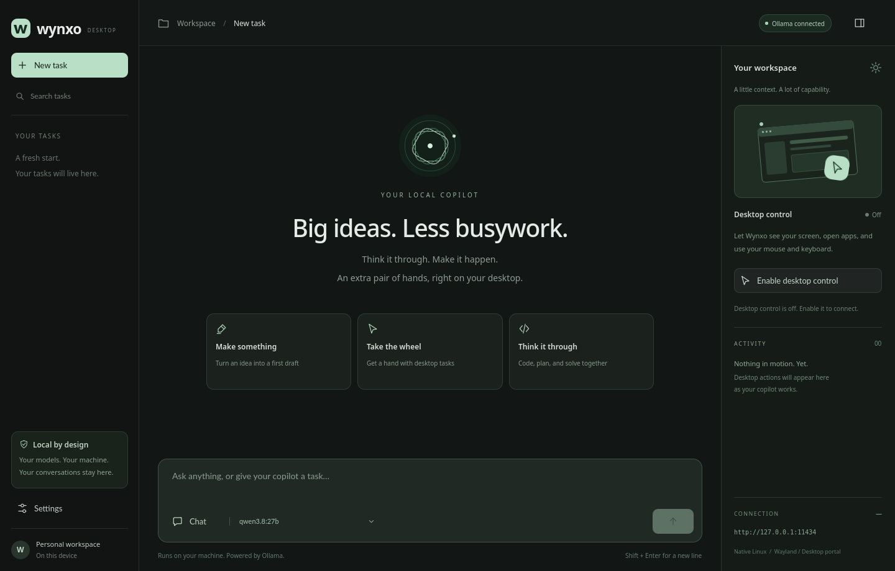

# Wynxo

**A local AI copilot for your Linux desktop.**

Wynxo is a native Python + Qt Quick app with a dark workspace, streamed conversations, saved tasks, model controls, subtle motion, and a live activity panel. Connect your existing Ollama server, choose a model, and chat—or enable desktop control to let a capable model open apps, move the pointer, type, click, scroll, and draw with mouse strokes.

No browser window, Node.js, hosted account, or API key is required. Ollama runs inference separately; Wynxo is the GUI that connects to it.



## Install

Requires **Linux, Python 3.10+, and Git**. Install as your normal user:

```bash
git clone https://github.com/wynxo/wynxo-gui-ai-agent.git
cd wynxo-gui-ai-agent
python3 install.py
```

`./install` does the same thing. Open **Wynxo** from your application menu, or run:

```bash
~/.local/bin/wynxo
```

The installer creates its own Python environment, installs dependencies, and registers a launcher and icon. It copies the app, so you can move or remove the checkout afterward. It does not need `sudo`, modify your system Python, start a background service, install Ollama, or download a model. The first installation needs internet access to download Python packages.

If Debian/Ubuntu reports missing `venv` support:

```bash
sudo apt install python3-venv
python3 install.py
```

## Connect Ollama

1. Install [Ollama for Linux](https://docs.ollama.com/linux), if you do not already have it.
2. Ensure Ollama is running. If it is not managed by a service, run `ollama serve` in a separate terminal.
3. Open Wynxo → **Settings**. The default server is `http://127.0.0.1:11434`.
4. Choose an installed model. To download another, enter its exact Ollama model tag in Settings and start the download. Downloads only happen when you request them.

The requested preference is **`qwen3.8:27b`**. Wynxo selects it when it is installed; otherwise, it offers your available models. A tag must actually exist in your Ollama installation or registry; Wynxo cannot make a missing model available. You can also use a local model you imported under that name. Run `ollama list` to check your installed tags.

For chat, use any compatible local chat model. For desktop work, the model must advertise the relevant capabilities through Ollama:

| Model capabilities | What Wynxo can do |
| --- | --- |
| Chat | Stream answers and save conversations |
| Tools | Discover and open installed desktop apps |
| Vision + tools | Read screenshots, click, type, use shortcuts, scroll, and drag to draw |

A large text model without vision cannot see buttons or a canvas. Wynxo disables visual input tools when vision is unavailable. If your model does not support tool calling, desktop requests remain conversational. Model size alone does not determine these abilities. Larger models also need more memory and may respond slowly on CPU.

Wynxo reads capabilities from Ollama rather than guessing from model names. See Ollama's [API introduction](https://docs.ollama.com/api/introduction) and [tool calling documentation](https://docs.ollama.com/capabilities/tool-calling).

## Use your desktop copilot

Start with a small task:

> Open KolourPaint and draw a simple smiley face in the middle of a new canvas.

Enable **Desktop control** before sending the request. On Wayland, allow the desktop's screen-sharing and input permissions. Install the requested drawing app yourself first; Wynxo discovers apps through their desktop entries.

The activity panel shows the model's actual tool calls and whether they succeeded. Screenshots provide visual feedback to a model with vision. Pointer motion and keyboard input affect your real desktop. Use **Stop** to cancel the current task, or disable Desktop control to revoke the app's input access. An action already completed is not undone by stopping.

Desktop control starts off each time you open Wynxo. Runs have a 20-action limit; review the result and send a follow-up to continue a longer task. Keep early tasks simple while you assess your model's reliability: successful tool execution does not by itself prove the model chose the right button.

## Desktop support

| Session | Backend | Current limits |
| --- | --- | --- |
| KDE/GNOME Wayland | XDG RemoteDesktop, ScreenCast and Screenshot portals | Select every monitor; compositor permission required; screenshot prompts depend on the portal implementation |
| X11 | XTEST input + Pillow screenshots | Requires XTEST; keyboard characters must be available in the active keymap |
| No graphical session | Chat only | Desktop input and capture are unavailable |

On Wayland, select every monitor in the permission dialog so Wynxo can map screenshot pixels to the correct input stream. A compositor must implement the required portals and expose monitor positions. If permission is denied or a portal is unavailable, Wynxo reports the error; it cannot bypass the desktop's permission system. Wayland support needs testing on your specific compositor/version.

On Debian KDE, these packages supply the usual desktop integration pieces:

```bash
sudo apt install xdg-desktop-portal xdg-desktop-portal-kde libglib2.0-bin
```

Use your desktop's corresponding portal backend on other environments. `libglib2.0-bin` supplies `gio`, which launches installed apps. Backend details follow the [XDG desktop portal interfaces](https://flatpak.github.io/xdg-desktop-portal/docs/).

## Your workspace

- Stream replies, view model thinking when available, and see generation speed.
- Start, reopen, rename, and delete saved tasks.
- Copy responses or export a conversation to Markdown.
- Switch between installed models and download a model from Settings.
- Enable reduced motion in Settings.
- Keep using chat while desktop access is off or unavailable.

| Shortcut | Action |
| --- | --- |
| Enter / Shift+Enter | Send / insert a new line |
| Ctrl+N | New task |
| Ctrl+K | Search saved tasks |
| Ctrl+, | Settings |
| Escape / Ctrl+Shift+S | Stop the current task **while Wynxo has keyboard focus** |

The stop shortcuts are window shortcuts, not global hotkeys. If another app has focus, switch back to Wynxo and use Stop; you can also end the desktop sharing session through your compositor's controls.

History and settings are stored in a local SQLite database at `~/.local/share/wynxo/history.sqlite3`, or under `$XDG_DATA_HOME/wynxo`. Screenshot image payloads are not saved in chat history. The Wayland screenshot portal may create temporary capture files of its own.

Wynxo only accepts loopback Ollama endpoints, disables HTTP proxy inheritance, and refuses redirects. Use locally installed models for local inference; your Ollama server and its model configuration determine where inference runs. This project has no telemetry or hosted backend.

## Update or remove

To update, pull the latest code and rerun the installer:

```bash
git pull
python3 install.py
```

An upgrade builds a new environment before switching the active release. A failed installation keeps the previous version usable. Previous release files remain until uninstall so a running app can finish using them; restart Wynxo to use an update.

Remove the installed app from anywhere:

```bash
~/.local/bin/wynxo --uninstall
```

Or run `python3 uninstall.py` from the checkout. Conversations and settings are kept by default. To remove them **as well as the app**, use:

```bash
~/.local/bin/wynxo --uninstall --purge
```

Uninstall never removes Ollama or downloaded model files. Modified launchers, modified desktop entries, unknown installation files, and user-data symlinks are preserved and reported.

Default installation locations:

| Item | Location |
| --- | --- |
| App + isolated Python environments | `$XDG_DATA_HOME/wynxo-app` (default `~/.local/share/wynxo-app`) |
| Launcher | `~/.local/bin/wynxo` |
| Application menu entry | `$XDG_DATA_HOME/applications/io.github.wynxo.Wynxo.desktop` |
| App icon | `$XDG_DATA_HOME/icons/hicolor/scalable/apps/io.github.wynxo.Wynxo.svg` |
| Conversations + settings | `$XDG_DATA_HOME/wynxo/history.sqlite3` |

Advanced: `python3 install.py --install-root /path/to/wynxo-app --bin-dir /path/to/bin`. Pass the same install root to `uninstall.py`, or use that installation's launcher. Paths containing spaces are supported. The installer refuses to overwrite paths it does not own.

## Troubleshooting

**Ollama unavailable:** Check `ollama list` and `curl http://127.0.0.1:11434/api/tags`. The Settings URL is the server origin, without `/api`. If Ollama is already running as a service, do not start a second server on the same port.

**A model cannot be found:** Use a tag listed by `ollama list` or an available tag from the Ollama library. A failed download leaves the existing models alone.

**Qt cannot load the xcb plugin:** A minimal Debian/Ubuntu desktop may need:

```bash
sudo apt install libxcb-cursor0 libxkbcommon-x11-0 libegl1 libgl1
```

Run the launcher from a terminal to see missing library diagnostics. Package names vary by distro; see [Qt's Linux requirements](https://doc.qt.io/qt-6/linux-requirements.html).

**Graphics-driver rendering issues:** Try `QT_QUICK_BACKEND=software ~/.local/bin/wynxo`. Reduced motion is also available in Settings.

**The `wynxo` command is missing:** Use `~/.local/bin/wynxo` or the application menu. Add `~/.local/bin` to your shell's `PATH` if desired; the installer does not edit shell configuration.

**Desktop control is unavailable:** Check the session/backend explanation in Wynxo, grant the desktop's permission prompt, select every monitor, and confirm portal support. If a compositor does not report monitor positions, update its portal backend or use a single display for this version. X11 is an alternative when available from your login screen.

## Development

```bash
python3 -m venv .venv
.venv/bin/python -m pip install -e . pytest
.venv/bin/python -m wynxo
.venv/bin/python -m pytest -q
```

`wynxo/ui` contains the Qt Quick interface; `controller.py` bridges worker threads and the UI; `engine.py` handles Ollama and the tool loop; `desktop.py` handles Linux desktop integration; `storage.py` manages history. The installer uses only Python's standard library and can run before app dependencies are installed.

Headless UI smoke test:

```bash
QT_QPA_PLATFORM=offscreen QT_QUICK_BACKEND=software .venv/bin/python -m wynxo --smoke-test
```

Tests cover network streaming with simulated Ollama responses, desktop action validation using test backends, storage, and install/uninstall transactions. They do not establish end-to-end reliability of an arbitrary model or compositor. A real screenshot → model → drawing task still depends on your installed model, running Ollama, drawing app, and desktop permissions.

Wynxo is an independent project, not affiliated with OpenAI, Anthropic, Tesla, or xAI. MIT licensed; third-party dependencies keep their own licenses.
